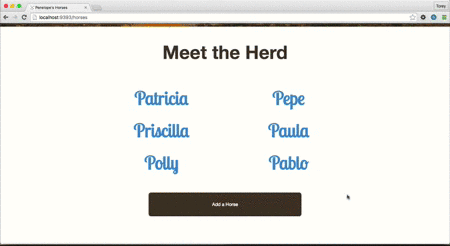
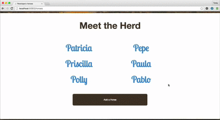

# AJAX Checkpoint Challenge

## Summary
This challenge is designed to check your ability to enhance a web application through AJAX.  Working through the releases, you will make various AJAX requests and then update the DOM based on the response.  The goal of this challenge is to better understand your personal ability to implement AJAX, identifying areas where you are on track and where you need to improve.

## Releases
### Pre-Release:  Describe AJAX
In your own words in the `ajax-description.md` file, (1) describe what AJAX is and (2) write a brief overview of how to make an AJAX call. Your responses don't need to be perfect by any means, just briefly explain what you understand about AJAX.

### Pre-Release:  Explore the Functioning App
You're provided with a functioning, one-resource CRUD application, a simple app that allows Penelope to keep track of her horses.  Setup the application by bundling and then creating, migrating, and seeding the database.  Afterward read through the provided code and click through the site to understand how it functions.

### Release 0:  Dynamically Load a Form
In this application, how does Penelope add new horses to her herd?  From the landing page, she needs to navigate to another page where the form resides.  She'd prefer to have a smoother work flow, so you're going to begin enhancing the site with AJAX. You don't want to change any of the site's current functionality, just enhance the user experience by implementing some AJAX calls (i.e., the site should work with or without JavaScript).

The first enhancement is to dynamically load a form for creating a new horse when Penelope clicks the "Add a Horse" button (see Figure 1).  Feel free to edit the provided code as necessary, adding any id's, classes, or partials you need to complete the requirements.

  
*Figure 1*.  Adding a form to the homepage

### Release 1:  Update the Page after Submitting the Form
Penelope is pleased with our update, but she's asking for another update.  When she submits the dynamically loaded form, she's currently taken to a new page showing the new horse.  She would prefer to stay on the page and have the new horse added to the list of horses (see Figure 2).

  
*Figure 2*.  Adding a new horse to the list.

### Release 2:  Dynamically Load Horse Details
Penelope is impressed with our updates, so she's asking us to do more work on the site.  The list of horses contains links to pages that show the details of each horse:  the name, breed, and age.  Rather than navigate to a new page, Penelope would like to click on a horse's name and have the details dynamically loaded (see Figure 3).

*Note:*  This should work for horses listed when the page originally loaded and also for horses added to the list.

  
*Figure 3*.  Showing the details for a horse.

### Release 3:  Refactor
Have you added all the required functionality?  Refactor your code. Can you JavaScript be better organized? Also, double check your controller's route handlers.  Is there code well written?  Do they allow for responding to both AJAX and normal HTTP requests?

## Conclusion
When you're finished, commit your changes, but wait to push your branch to Github until time is called.

Reflect on how the challenge went.  Remember, this challenge is a checkpoint for you to gauge your progress in working with AJAX.  What do you know well?  In what areas do you need to make progress?  

